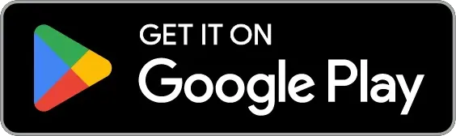

# 𝕌𝕓𝕚𝕤𝕔𝕠𝕡𝕖 - A Platform for Collecting and Debugging Ubiquitous Information

## Features

### [client_app](packages/client_app)

- Client application for iOS and Android that supports collecting ubiquitous information
- Registration of measurement points based on Google Maps
- Collection of Wi-Fi and iBeacon at measurement points

#### Frameworks and Main Packages Used

- Flutter
- Firebase
- Riverpod
- go_router
- freezed
- pigeon
- pedantic_mono
