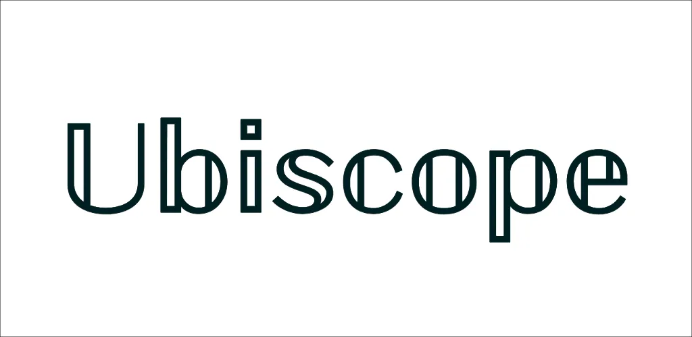

  

<h2 align="center">
  𝕌𝕓𝕚𝕤𝕔𝕠𝕡𝕖 - A Platform for Collecting and Debugging Ubiquitous Information
</h2>

## Features

### [client_app](packages/client_app)

- Client application for iOS and Android that supports collecting ubiquitous information
- Registration of measurement points based on Google Maps
- Collection of Wi-Fi and iBeacon at measurement points
